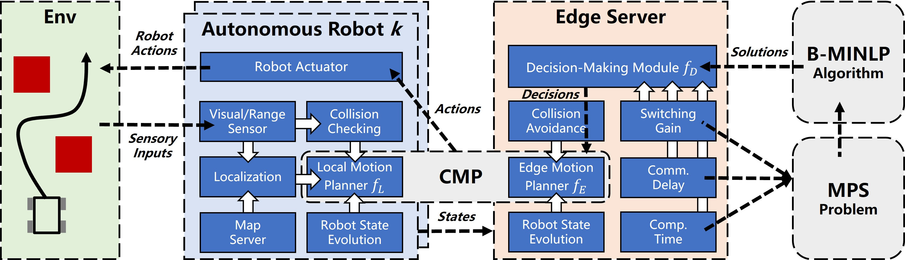
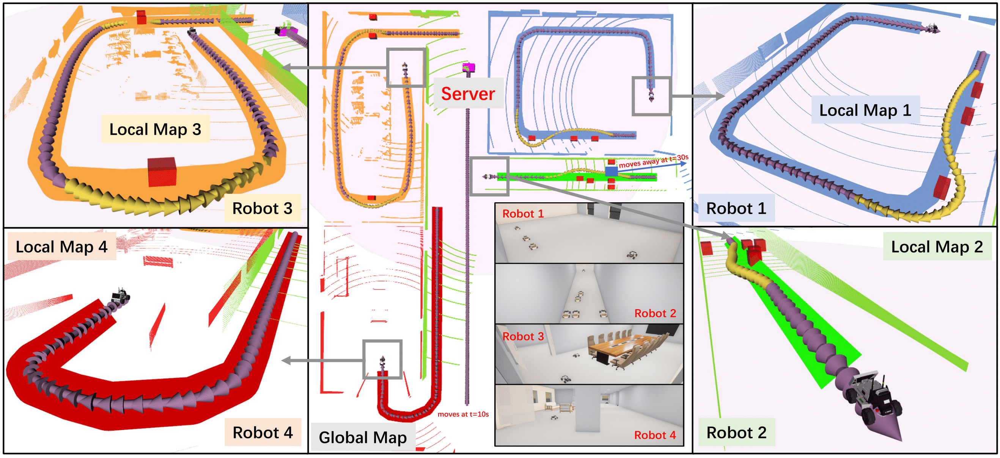
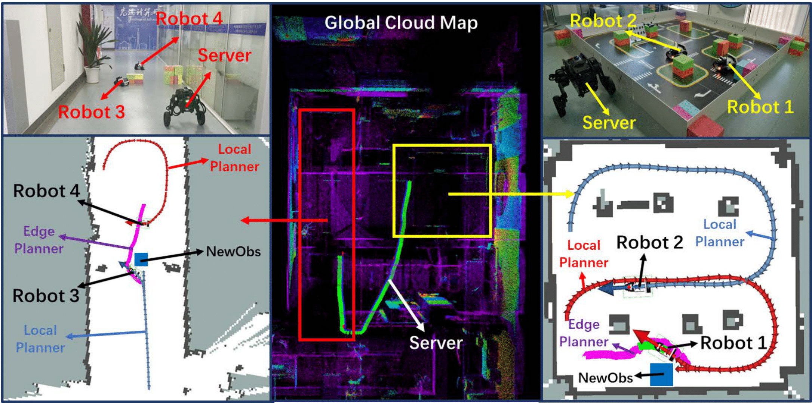

# EARN

Edge Accelerated Robot Navigation With Collaborative Motion Planning



## News

- [2024/06]: EARN has been accepted by *IEEE/ASME Transactions on Mechatronics (TMECH)* and the code will be released recently.
- [2023/11]: The preprint version of EARN is available on [arXiv](https://arxiv.org/abs/2311.08983).

## Simulations



## Experiments



## Video

https://github.com/GuoliangLI1998/EARN/assets/107024891/21dcf0b7-ad05-4bb3-bbad-3f255fed22bc

## Citation

If you find our work helpful in your research, please consider citing:

```bibtex

@article{li2023edge,
  title={Edge Accelerated Robot Navigation with Collaborative Motion Planning},
  author={Li, Guoliang and Han, Ruihua and Wang, Shuai and Gao, Fei and Eldar, Yonina C and Xu, Chengzhong},
  journal={IEEE/ASME Transactions on Mechatronics},
  year={2024},
  publisher={IEEE}
}

```

## Acknowledgement

We would like to thank the authors and developers of the following projects, this project is built upon these great open-sourced projects.
* [Carla](https://github.com/carla-simulator/carla)
* [Carla-ROS-Bridge](https://github.com/carla-simulator/ros-bridge)
* [RDA](https://github.com/hanruihua/RDA_planner)

## Authors

[Guoliang Li](https://github.com/GuoliangLI1998)

[Ruihua Han](https://github.com/hanruihua)

[Shuai Wang](https://github.com/bearswang)
